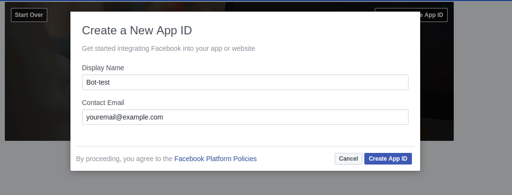
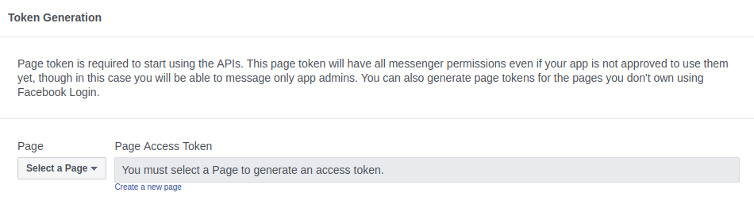
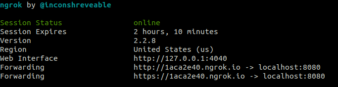
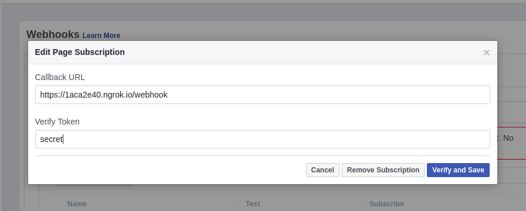

# That-s-you-Bot-

Messenger bot which takes the role of a game similar to the game That's you. The game can be played between 2 and 6 players.

# Install

```
$ go get https://github.com/AntoniPD/That-s-you-Bot-
```

# Prerequisites

You need to make your own bot. First you must make your own facebook page. After you are done with that go to https://developers.facebook.com/quickstarts and click create App ID, give your bot a name and continue.


- you have to select product -> click Messenger and then click Set-up.
- create .env file in the directory of the cloned project.


- Choose your webpage and generate token after that add it in the created .env file.
  
Now you have to setup your webhook => you will need to install ngrok.
download it from https://ngrok.com/download.

Go in the directory where you installed it and run:
```
$ ./ngrok http 8080
```
You will see:



- now copy the https url.
- return to the facebook developers page and click Setup Webhooks.



- paste the url and add /webhook to it.
- set your verify token and copy paste it to the .env file
  
Now you can run your own bot. But for now the implementation is stil in progress.

